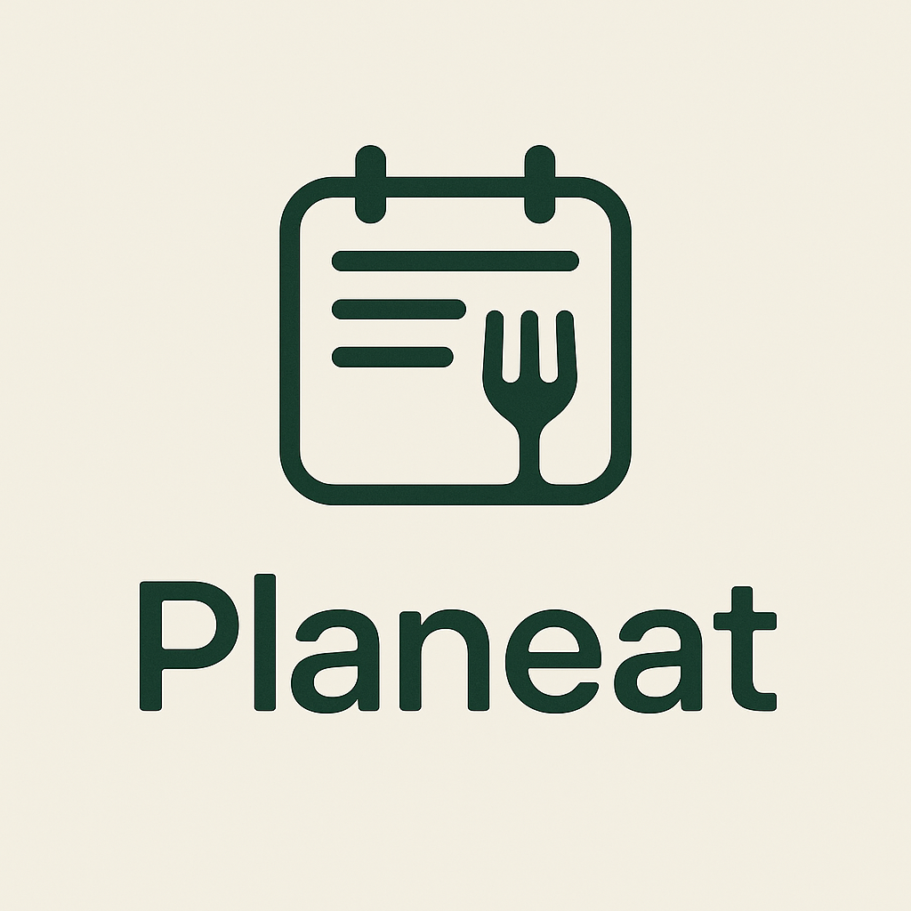

# Planeat 🍽️

<p align="center">
  
</p>

Planeat es una aplicación web moderna diseñada para ayudarte a planificar tus comidas de manera eficiente y saludable. Desarrollada con tecnologías modernas, Planeat te permite organizar tus recetas, crear planes de comidas y gestionar tu lista de compras de manera intuitiva.

## 🚀 Características principales

- 📝 Planificación de comidas semanal adaptable (el menú se genera solo para los días restantes si se crea a mitad de semana)
- 📋 Gestión y búsqueda de recetas con nombres normalizados (soporte para tildes y ñ)
- 🛒 Lista de la compra automática, agrupada por tipo de ingrediente y con sumas inteligentes de cantidades
- 🌗 Modo claro/oscuro en toda la app
- 🖼️ Favicon y branding personalizados con el logo de Planeat
- 📱 Diseño responsive y profesional
- 🎨 Interfaz moderna, atractiva y coherente
- 👤 Perfil de usuario con objetivo y restricciones alimentarias
- 🔒 Autenticación y registro seguro
- 🗓️ Visualización de fechas y días reales en el menú semanal
- ✅ Feedback visual y animaciones (confeti al completar la compra, etc.)

## 🛠️ Tecnologías Utilizadas

- React
- TypeScript
- Vite
- Node
- Tailwind CSS
- Supabase
- SweetAlert2

## 📦 Instalación

1. Clona el repositorio:
```bash
git clone https://github.com/titicuevas/planeat.git
```

2. Navega al directorio del proyecto:
```bash
cd planeat
```

3. Instala las dependencias:
```bash
npm install
```

4. Inicia el servidor de desarrollo:
```bash
npm run dev
```

## 🏗️ Estructura del Proyecto

```
src/
├── components/     # Componentes reutilizables
├── pages/          # Páginas de la aplicación
├── hooks/          # Custom hooks
├── types/          # Definiciones de tipos TypeScript
├── utils/          # Utilidades y funciones auxiliares
├── api/            # Lógica de integración con Gemini y otras APIs
└── config/         # Configuración de Supabase y otros servicios
public/
└── logo/Logo.png   # Logo y favicon de Planeat
```

## 🔧 Backend y API

El proyecto incluye un servidor Node.js (`geminiServer.js`) que actúa como backend para la integración con la API de Gemini. Este servidor proporciona dos endpoints:

- `/api/generate-menu`: Genera un menú semanal basado en un prompt enviado.
- `/api/receta-detalle`: Obtiene la receta detallada de un plato específico.

Para ejecutar el servidor, asegúrate de tener configurada la variable de entorno `GEMINI_API_KEY` y ejecuta:

```bash
node geminiServer.js
```

## 🆕 Novedades recientes

- Nuevo favicon y logo en todas las pestañas (`public/logo/Logo.png`)
- Títulos de pestaña personalizados para cada vista (Dashboard, Cesta, Recetas, Perfil, etc.)
- Generación dinámica de menús: si creas el menú a mitad de semana, solo se generan los días restantes
- Visualización de días y fechas reales en el menú semanal (siempre hasta domingo)
- Lista de la compra agrupada por tipo de ingrediente y con sumas/conversiones de cantidades
- Modo oscuro mejorado y coherente en toda la app
- Feedback visual profesional y animaciones

## 🤝 Contribuir

Las contribuciones son bienvenidas. Por favor, sigue estos pasos:

1. Haz un Fork del proyecto
2. Crea una rama para tu feature (`git checkout -b feature/AmazingFeature`)
3. Commit tus cambios (`git commit -m 'Add some AmazingFeature'`)
4. Push a la rama (`git push origin feature/AmazingFeature`)
5. Abre un Pull Request

## 📝 Licencia

Este proyecto está bajo la Licencia MIT. Ver el archivo `LICENSE` para más detalles.

## 📧 Contacto

Titicuevas - [@titicuevas](https://github.com/titicuevas)

Link del Proyecto: [https://github.com/titicuevas/planeat](https://github.com/titicuevas/planeat)
